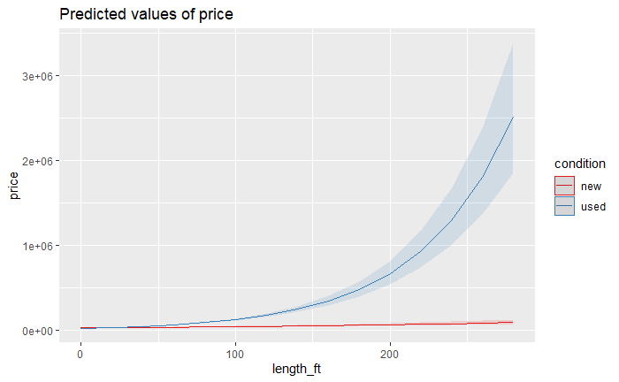
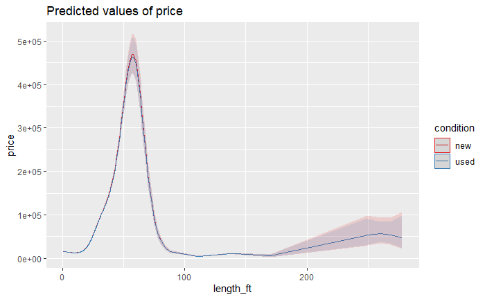

# Approach

The approach for model building here is to start with a small set of predictors that we think has the greatest impact on the price variable. This is based on the plots we saw in the previous section. We will then add predictors to the model and see if there is an imporvement in the model performance.
We will always be using `log(price)` as the target variable, since `price` is not normal.

We will also employ the library `sjPlot` to produce visualizations of some models and give us a good summary display for the model.

Intrepretation for the models is only provided for models that can be explained easily. Non linear models don't lend themselves to easy explanations.

Before we start the analysis, we will rename our data set `data_noOutliers` to be just `data` for ease of coding.

```{r}
data <- data_noOutliers
remove("data_cleaned", "data_noOutliers")

library(sjPlot)
```

# Model building

## Linear model with length, age and condition
For our first model we will consider the effect of the three predictors, `length_ft`, `age` and `condition`. These three will likely have a large impact on the price.

```{r}
mod.lm.1 <- lm(log(price) ~ length_ft+age+condition, data=data)
summary(mod.lm.1)
```

All three values are signigcant. However, this model has a very low R-squared value of `r summary(mod.lm.1)$r.squared`. Adjusted R-squared : `r summary(mod.lm.1)$adj.r.squared`

### Model Explanation
As length increases by 1 ft, the model predicts that the price will increase by `r 0.0104*100`%, given everything else is constant
As age increases by 1 year, the model predicts that the price will decrease by `r 0.0163*100`%, given everything else is constant
A used boat usually has a higher price than the new boats. _This doesn't seem to intuitively make sense to me._ 

## Adding an interaction term between length and condition

```{r}
mod.lm.2 <- lm(log(price) ~ length_ft+age+condition+condition*length_ft, data=data)
summary(mod.lm.2)
```

Adding this interaction term improved our performance slightly to a new R-squared value of `r summary(mod.lm.2)$r.squared`. with an adjusted r-squared of `r summary(mod.lm.2)$adj.r.squared`.
We can visualize the effect the interaction term using the plot below. This assumes the age is held constant. Note that the plot has back-transformed the variable `log(price)` to `price`. This model seems to indicate that the impact of length on used models is higher than those of the new models by a huge amount.

### Model Explanation
```
plot_model(mod.lm.2, type="pred",terms = c("length_ft","condition"))
```


As length increases by 1 ft, for a new boat the price increases by `r 0.0041877*100`% and by `r (0.0041877+0.0123881)*100` for an used boat given the age is constant.
As age increases by 1 year, the price decreases by `r 0.0174919*100`% given everything else is constant.


## Adding non-linear terms for length
### Squared term for length
We can add a squared term for lenth to see if it has an impact on the model performance.

```{r}
length_ft.sq <- (data$length_ft)^2
mod.lm.4 <- lm(log(price) ~ length_ft+length_ft.sq+age+condition+condition*length_ft, data=data)
summary(mod.lm.4)
```

We see a large increase in model performance. The r-squared value is now at `r summary(mod.lm.4)$r.squared` and the adjusted r-squared value is `r summary(mod.lm.4)$adj.r.squared`.


## GAM model with smoothing for length
```{r}
library(mgcv)
mod.gam.1 <- gam(log(price) ~ s(length_ft)+age+condition+condition*length_ft, data=data)
summary(mod.gam.1)
```

The gam model explains over 62% of the variation in the price. However we loose significance for the condition and interaction term. The impact of length on the price _(not log(price))_ is shown in the plot below. _ Standard errors are still on the log-scale._ Around 50 ft in length, the impact of length on price inverses. This seems to inicate that boats larger than 50 ft are undesirable untill the length is greater than around 150ft where the trend seems to pick up again.




## GAM model with smoothing for length and age

```{r}
mod.gam.2 <- gam(log(price) ~ s(length_ft)+s(age)+condition+condition*length_ft, data=data)
summary(mod.gam.2)
```

Once again we see an improvement in the model with the model now explaining 67.2% of the variation in price the plots below clearly illustrate the impact of age and length on the price variable. Price of boats decreases as the age of the boats increases, however after a certain age, a boat could be considered antique(around 50) and it's price increases again.

``` {r echo=FALSE}
plot_model(mod.gam.2, type="pred",terms = c("length_ft","condition"))
plot_model(mod.gam.2, type="pred",terms = c("age","condition"))
```


We can try to model these effects using a variable for isAntique as we discussed in the visualization section. For length, we can model isLong as another control.

## Linear model with controls for antique boats and longer boats

```{r}
data$isAntique = as.numeric(data$age >=50)
data$isLong = as.numeric(data$length_ft >=65)

mod.lm.5 <- lm(log(price) ~ length_ft+age
               +isLong+isLong*length_ft
               +isAntique+isAntique*age
               +condition, 
               data =data)
summary(mod.lm.5)

```

Using controls and interaction terms for long boats and antique boats, we get a linear model that is much better than our other linear models. This may not be as good as the GAM model with smoothing, but lends itself to much better explanation.

### Model explanation
As the length of the boat increases by 1ft, the price increases by `r 0.09466*100`% if the boat is shorter than 65 ft. But if the boat is longer than 65ft, the price decreases by `r (0.10734- 0.09466)`% for every additional feet, given everything else is held constant.
As the age of the boat increases by 1 year, the price decreases by `r 0.0502*100`% if the boat is younger than 65 years. But if the boat is older than 65 years, every additional year increase in age, increases the price by `r (0.06563-0.05021)*100`% given everything else is held constant.

GAM models will always do better tah our linear approximation model. For the following analysis we will only build linear models to evaluate perfromance, and at the end compute a gam model based on the predictors in the linear model.

## Adding additional parameters to the existing models
### Hull Material
```{r}
mod.lm.6 <- lm(log(price) ~ length_ft+age
               +isLong+isLong*length_ft
               +isAntique+isAntique*age
               +hullMaterial
               +condition+condition*length_ft, 
               data =data)
summary(mod.lm.6)
```
Most Hull Material types are significant, however hullMaterial pvc and steal are not significant. We now have a model with an adjusted r-squared of `r summary(mod.lm.6)$adj.r.squared`.

### totalHP
```{r}
mod.lm.7 <- lm(log(price) ~ length_ft+age
               +isLong+isLong*length_ft
               +isAntique+isAntique*age
               +hullMaterial + totalHP
               +condition+condition*length_ft, 
               data =data)
summary(mod.lm.7)
```

We see a slight imporvement in adding the total HP of the engine to the model. Total HP of the engines is a significant predictor and an increase in 10 HP of the engine increases the price by only `r 4.194e-04*100*10`%. The condition control variable now loses significance. We now have a model with an adjusted r-squared of `r summary(mod.lm.7)$adj.r.squared` which is a slight improvement over our previous model.

### Make

We will add the make (top5 vs rest) to the model.

```{r}
mod.lm.8 <- lm(log(price) ~ length_ft+age
               +isLong+isLong*length_ft
               +isAntique+isAntique*age
               +hullMaterial + totalHP + make.top5
               +condition+condition*length_ft, 
               data =data)
summary(mod.lm.8)
```

The make of the boat is also very significant to the model. We now have a model with an adjusted r-squared of `r summary(mod.lm.8)$adj.r.squared`. Bennington boats seem to have higher prices that the average of other (non top 5) boats while the other top 5 boats seem to do worse.

We can also try to model the resale value of the boat makes bu adding an interaction term between make and condition.

```{r}
mod.lm.8_1 <- lm(log(price) ~ length_ft+age
               +isLong+isLong*length_ft
               +isAntique+isAntique*age
               +hullMaterial + totalHP 
               + make.top5 + make.top5*condition
               +condition+condition*length_ft, 
               data =data)
summary(mod.lm.8_1)
```

There is not enough improvement in the model to sacrifise the degrees of freedom by adding an interaction term for resale value by make. But we can infer that Bennington made boats fare better in resale as well.

### fuelType
```{r}
mod.lm.9 <- lm(log(price) ~ length_ft+age
               +isLong+isLong*length_ft
               +isAntique+isAntique*age
               +hullMaterial + totalHP
               + fuelType 
               +condition+condition*length_ft, 
               data =data)
summary(mod.lm.9)
```

This model did not add any new information to the model and the adjusted r-squared value did not improve. This may be because the total horsepower of the engine already encapsulates the type of fuel to a certain extent. Furthermore, not all boats have a fuelType, so this model reduces the number of observations.


### Engine Type
```{r}
mod.lm.10 <- lm(log(price) ~ length_ft+age
               +isLong+isLong*length_ft
               +isAntique+isAntique*age
               +hullMaterial + totalHP
               + engineCategory
               +condition+condition*length_ft, 
               data =data)
summary(mod.lm.10)
```

Adding engine category boosted the model perfromance, however none of the engine categories are significant, and we lost a lot of degrees of freedom due to boats not have an engine type listed.

We can see if having an engineType listed, meaning the seller is very thorough in their listing or the boat comes with an engine has an effect on price.


```{r}
hasEngineListed <- as.numeric(!is.na(data$engineCategory))
mod.lm.10_1 <- lm(log(price) ~
               hasEngineListed,
               data =data)
summary(mod.lm.10_1)
```

Has engine listed is not a significant predictor for price.


#### Engine type in isolation

```{r}
hasEngineListed <- as.numeric(!is.na(data$engineCategory))
mod.lm.10_2 <- lm(log(price) ~
               engineCategory,
               data =data)
summary(mod.lm.10_2)
```
Again, engine category is not a significant predictor for price.


## Seller Volume
The rational here is to find out if the volume sold be the seller has an effect on price.

```{r}
mod.lm.11 <- lm(log(price) ~ length_ft+age
               +isLong+isLong*length_ft
               +isAntique+isAntique*age
               +hullMaterial + totalHP
               + sellerVolume
               +condition+condition*length_ft, 
               data =data)
summary(mod.lm.11)
```
Seller volume is significant, however doesn't improve the model by much.

### Seller volume in isolation

```{r}
mod.lm.11_1 <- lm(log(price) ~  sellerVolume, 
               data =data)
summary(mod.lm.11_1)
plot_model(mod.lm.11_1,type="pred")


mod.lm.11_1.gam <- gam(log(price) ~  s(sellerVolume), 
               data =data)
summary(mod.lm.11_1.gam)
plot_model(mod.lm.11_1.gam,type="pred")
```

In isolation, seller volume seems to have a negative relationship with price. For every additional unit listed by a seller, he price decreases by `r 3.932e-04*100`%


## Market Size
This is to investigate if the market size (number of listings in a state) has an effect on price

```{r}
mod.lm.12 <- lm(log(price) ~ length_ft+age
               +isLong+isLong*length_ft
               +isAntique+isAntique*age
               +hullMaterial + totalHP
               + marketSize
               +condition+condition*length_ft, 
               data =data)
summary(mod.lm.12)
```

There is no significant improvement in the model. However, market size is significant.

### Market Size in isolation
```{r}
mod.lm.12_1 <- lm(log(price) ~ marketSize, 
               data =data)
summary(mod.lm.12_1)
plot_model(mod.lm.12_1, type="pred")

mod.lm.12_1.gam <- gam(log(price) ~ s(marketSize), 
               data =data)
summary(mod.lm.12_1.gam)
plot_model(mod.lm.12_1.gam, type="pred")
```

In isolation Market size is significant, for every 100 additional units listed in a state, the price increases by `r 9.351e-05*100*100`%.

The GAM model better captures the market size impact on price. But doesn't make intuitive sense.

## Type of boat
```{r}
mod.lm.13 <- lm(log(price) ~ length_ft+age
               +isLong+isLong*length_ft
               +isAntique+isAntique*age
               +hullMaterial + totalHP
               + type
               +condition+condition*length_ft, 
               data =data)
summary(mod.lm.13)
```
Again, the type doesn't seem to improve the model by a significant amount.


## Beam length
```{r}
mod.lm.14 <- lm(log(price) ~ length_ft+age
               +isLong+isLong*length_ft
               +isAntique+isAntique*age
               +hullMaterial + totalHP
               + beam_ft
               +condition+condition*length_ft, 
               data =data)
summary(mod.lm.14)
```

There is a significant improvement when adding beam length to the model. However, since the beam length is not available for all the listings hence the comparision to other models is not an apples to apples comparision.

## Kitchen sink Model
```{r}
mod.lm.ks<- lm(log(price) ~ length_ft+age
               +isLong+isLong*length_ft
               +isAntique+isAntique*age
               +hullMaterial + totalHP + make.top5
               + type + engineCategory + fuelType 
               + sellerVolume + marketSize
               +condition+condition*length_ft, 
               data =data)
summary(mod.lm.ks)
```

Again, we have lost a lot of degrees of freedom (and data points) for very little gain. The kitchen sink model is not a good model.

# Chosing the best model
Based on the analysis perfromed, among the linear models, `mod.lm.7` perfromed the best with the minimal number of parameters, however the variable `condition used` was not significant. 
The model was `r summary(mod.lm.7)$call`. Recall that the model `mod.lm.7` had an adjusted r sq value of `r summary(mod.lm.7)$adj.r.squared`.

We can try to build a model with the GAM with the same parameters as `mod.lm.7`, but with smoothing applied to length and age variables.

```{r}
mod.lm.best <- mod.lm.7
mod.gam.best <- gam(log(price) ~ s(length_ft)+s(age)
               +hullMaterial + totalHP
               +condition+condition*length_ft, 
               data =data)
summary(mod.gam.best)
```
The GAM model still performs better than the linear model.

##Understanding the choosen model
The following plots help visualise the model and the impact of each term on Price. Note that the model visualizations are back-transformed from log scale to regular scale for price.

```{r}
plot_model(mod.gam.best,type="pred")
```
The one thing of interest here is that used boats show a higher price than new boats. This may be due to bias in how the data was sampled.

We can choose the linear model described abve if we want to explain the model in an economic sense, while sacrificing the r-squared value.


# Fine tuning the model & Diagnostics
## Investigating seasonality 

One aspect of the prices we have not evaluated is the seasonality of the data. Does the season in which the listing is posted affect the pricing.

## Box plots
We can quickly visualise the distribution of price by month and by quarters.
```{r}
ggplot(data, aes(x=created_month, y=log(price),col=condition))+
    geom_boxplot(aes(group=created_month))
```

```{r}
data$created_quarter <- as.factor(ceiling(data$created_month/3))
ggplot(data, aes(x=created_quarter,group=created_quarter, y=log(price)))+
    geom_boxplot()
```

There is not enough variation to determine if the price is affected by seasonality of the posting determines the price. We can double check this by creating a linear model.

```{r}
mod.lm.seasonality_month <- lm(log(price) ~ as.factor(created_month), data=data)
summary(mod.lm.seasonality_month)
```
```{r}
mod.lm.seasonality_q <- lm(log(price) ~ as.factor(created_quarter), data=data)
summary(mod.lm.seasonality_q)
```
Interestingly, the linear models do show some significance in for the coefficient of q4, but not for other quarters. This can be explained by the fact that the boat market could have a less number of buyers in the winter months.

We can add this is q4 parameter to our choosen model to see if we get an improvement.

```{r}
data$q4 <- as.numeric(data$created_quarter == 4)
mod.lm.best_seasonality <- update(mod.lm.best, .~.+as.factor(created_quarter))
summary(mod.lm.best_seasonality)
```

We do see a slight improvement. Quarter 3 seems to fetch the best price for the boats and Q4 seems to be the worst time. This makes sense as more people tend to boat in the summer and fall months, and not so much in the winter or early spring.

## Adding ignored parameters that were significant
We found that Market Size, Seller Volume, `make.top5`, quaterly Seasonality did not improve the model significantly, however those predictors were significant. We might want to include those as an alternative model.

```{r}
mod.lm.significant <- update(mod.lm.best, .~.+marketSize+make.top5+sellerVolume+created_quarter)
mod.gam.significant <- update(mod.gam.best, .~.+marketSize+make.top5+sellerVolume+created_quarter)
summary(mod.lm.significant)
summary(mod.gam.significant)
```

```{r}
AIC(mod.lm.significant,mod.gam.significant, mod.lm.best,mod.gam.best)
```

Adding these does improve our model, so we will replace the "best" model described above with these.

```{r}
mod.lm.old <- mod.lm.best
mod.lm.best <- mod.lm.significant
mod.gam.old <- mod.gam.best
mod.gam.best <- mod.gam.significant
```

Now that we have a our best models (one linear and one GAM) we can try to see if we can apply some diagnostics on the models.

##For the linear model
We can look at some diagnostic plots for the linear model to determine of the assumptions for 

```{r fig.width=7, fig.height=6}
par(mfrow=c(2,2))
plot(mod.lm.best, cex=0.25)
par(mfrow=c(1,1))
```

The Residuals vs Fitted values and the normal Q-Q plot show some effects of fanning. But this is expected since even our log transformed price was not very normal as seen in the summary and visualizations section. There is very little we can do about this short of filtering out a considerable section of our dataset. 

In the Scale-Location plot, shows a slight dip in residuals towards the center of our log price range, but overall is pretty horizontal. This is due to the price ariable not having equal variance. Again there is not much we can do about this without filtering out a large section of the dataset.

Looking at the residuals vs leverage plot we see that the point 5264 has a very high residual and very high leverage. This can be conerning. we can get a better look at this point an the points 4904 and 7909. Let us also get the influence plot for this .

```{r fig.width=4, fig.height=3}
library(car)
influencePlot(mod.lm.best)
```

The point 5264 is definetely problamatic. The point 4904 has a few other points around it with similar leverage and residual values.

Let us examine these points.

```{r}
data[5264]
data[4904]
data[7908]
data[14266]
data[16460]
```

One thing that is common across some of these boats is that they are very long and have considerable length (>= 250ft). 
The other boats are just unusual (especially 14266, which is very old).
There are two ways to go about solving the length issue.

1. Introduce an additional control for veryLong boats (Greater than 200). Or stick to the GAM model that already models this
2. Remove these data points and see how the model behaves.

### Removing the outlier data points and running the model

```{r}
mod.lm.best_noOutliers <- update(mod.lm.best,data=data[data$length_ft<250])
summary(mod.lm.best_noOutliers)
influencePlot(mod.lm.best_noOutliers)
par(mfrow=c(2,2))
plot(mod.lm.best_noOutliers, cex=0.25)
par(mfrow=c(1,1))
```

We loose those pesky high leverage, high residual points. But we still have some points with high residuals. We can go aroud examining these more closely to determine if these are actual outliers. This is left as a future enhancement to this project.

### Adding a is veryLong variable data point
```{r}
data$isVeryLong <- as.numeric(data$length_ft >=250)
mod.lm.best_veryLong <- update(mod.lm.best, .~.+isVeryLong+length_ft*isVeryLong)
summary(mod.lm.best_veryLong)
influencePlot(mod.lm.best_veryLong)
par(mfrow=c(2,2))
plot(mod.lm.best_noOutliers, cex=0.25)
par(mfrow=c(1,1))
```

We see that the leverage for the larger boats has reduced but the residuals still seem pretty large. These could be considered as outliers and filtered out. However this is suggested as future work on the model and will not be covered in this report.

## The GAM Model

```{r}
par(mfrow=c(2,2))
gam.check(mod.gam.best)
par(mfrow=c(1,1))
```

We see similar a similar qq and residual v. prediction plots as seen in the linear models. All the variation in the data can be explained by the non notmality in the log transformed price data. There is not much we can do other than iterative filtering of the data points to find a good model. 


# Other considerations

## Engine type

We saw that the engine category reduced the number of data points we had and made our comparision to other models not fair. To give engine type a fair chance. We will filter data to our best model, and compare it with the model that had the engine type.

```{r}
fit.best.filtered = update(mod.lm.best, data = data[!is.na(data$engineCategory)])
summary(fit.best.filtered)
```

```{r}
fit.best.filtered_engine = update(fit.best.filtered, .~.+engineCategory)
summary(fit.best.filtered_engine)
AIC(fit.best.filtered_engine,fit.best.filtered)
```

Adding the engine type does improve our model and also gives us a slightly lower AIC. We could consider this model if we were sure we could get an engine type in every listing.


## Beam Length

Similar to engine type, we saw that beam length reduced the number of ovservations. To give it a fair chance. We will give it the same consideration as we did with engine type.

```{r}
fit.best.filtered2 = update(mod.lm.best, data = data[!is.na(data$beam_ft)])
summary(fit.best.filtered2)
```

```{r}
fit.best.filtered_beam = update(fit.best.filtered2, .~.+beam_ft)
summary(fit.best.filtered_beam)
AIC(fit.best.filtered_beam,fit.best.filtered2)
```

Again, we see slight improvements in the model fit adn this can be included in the chosen model if we were sure to get a beam length with every listing.


## FuelType 
Similar to the two examples above, we will consider fuel type.
```{r}
fit.best.filtered3 = update(mod.lm.best, data = data[!is.na(data$fuelType)])
summary(fit.best.filtered3)
```

```{r}
fit.best.filtered_fuelType = update(fit.best.filtered3, .~.+fuelType)
summary(fit.best.filtered_fuelType)
AIC(fit.best.filtered_fuelType,fit.best.filtered3)
```

There is a slight improvement in the model. Fuel Type can be considered as an additional predictor if the boats have a fuelType listed.

## Market Size by Zip code
We calculated mareket size by State, a similar analysis can be done on a zip code level. This analysis is suggested as an extension to the project that can be done in the future.


## Adding all three together

We can create an alternate model to predict data when all three are also available.

```{r}
mod.lm.filtered4 <- update(mod.lm.best, 
                     data= data[!is.na(data$fuelType)& !is.na(data$engineCategory) & !is.na(data$beam_ft)]) 
mod.gam.filtered4 <- update(mod.gam.best, 
                      data=data[!is.na(data$fuelType)& !is.na(data$engineCategory) & !is.na(data$beam_ft)])


mod.lm.alt <- update(mod.lm.filtered4, .~.+beam_ft+fuelType+engineCategory) 
mod.gam.alt <- update(mod.gam.filtered4,.~.+beam_ft+fuelType+engineCategory)
summary(mod.lm.alt)
summary(mod.gam.alt)
AIC(mod.lm.filtered4,mod.lm.alt,mod.gam.filtered4,mod.gam.alt)
```


The AIC improved dramatically and we were able to explain 81.9% of the variation in price. However, we lost over 3/4 of our observations. While this model is better than any of the ones we have seen before, it was built on a smaller dataset. Further more, engine category, marketSize, sellerVolume,beam_ft and seasonlity of the data are not significant to the GAM model.

Once we remove these we should end up with model that is similar to `fit.best.filtered_fuelType`. We can alter the GAM model to remove these parameters. We should also be able to add back data points since we are not inlucing engineCategory and beam_ft.

```{r}
mod.gam.alt <- update(mod.gam.alt,
                 .~.-beam_ft-engineCategory-marketSize-sellerVolume-created_quarter,
                 data=data[!is.na(data$fuelType)])
summary(mod.gam.alt)
```

Which is only slightly better than our best GAM model with sacrificing observation data points.


